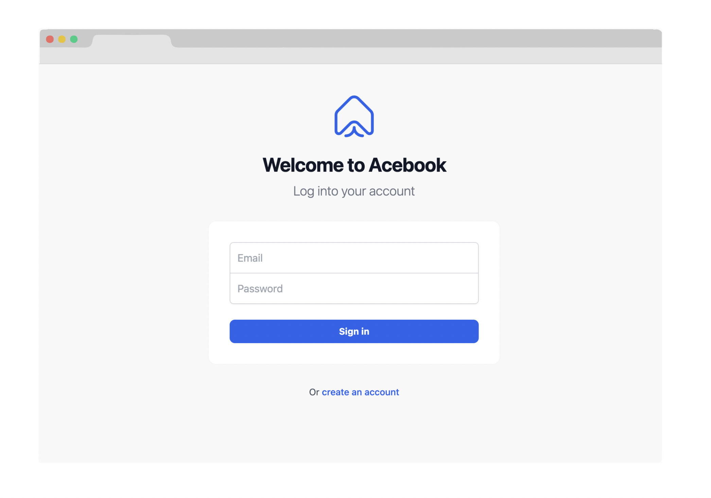

<a name="readme-top"></a>

<br />
<!-- PROJECT LOGO -->
<div align="center">
  <a href="https://github.com/terryhycheng/acebook">
    
  </a>

<h3 align="center">Acebook</h3>
<p>Scalable MERN Stack Social Network - User Connections Simplified</p>

  <p align="center">
    <a href="https://acebook-frontend-gwmk.onrender.com/">View Demo</a>
    ·
    <a href="https://github.com/terryhycheng/acebook/issues">Report Bug</a>
    ·
    <a href="https://github.com/terryhycheng/acebook/issues">Request Feature</a>
  </p>
</div>

<!-- TABLE OF CONTENTS -->

## Table of Contents

- [Table of Contents](#table-of-contents)
- [About The Project](#about-the-project)
  - [Features](#features)
  - [Built With](#built-with)
- [Getting Started](#getting-started)
  - [Prerequisites](#prerequisites)
  - [Installation](#installation)
  - [Start](#start)
    - [1. Start the server](#1-start-the-server)
    - [2. Start the frontend](#2-start-the-frontend)
- [Contributors](#contributors)

<!-- ABOUT THE PROJECT -->

## About The Project



Acebook is a full-stack web application built with the **MERN stack** that aims to replicate some of the core features and functionality of the popular social media platform, Facebook.

This project provides users with a platform where they can connect with friends, share posts, photos and react to other users' content, just like on Facebook. The application has been developed using modern web development technologies and best practices, making it a robust and scalable solution for anyone interested in building a similar social networking application.

Acebook was built by a team of **six developers** who utilize **Agile methodologies** and a **Git workflow** to collaborate efficiently and deliver high-quality code on time.

<p align="right">(<a href="#readme-top">back to top</a>)</p>

### Features

- **User Authentication**: Acebook can allow users to register, login and logout securely. This feature enables users to create their own profiles and secure their data.
- **User Profile**: Users can create and manage their profiles with photos, and personal information.
- **Posts**: Users can create and share text and photos with other users. They can like, comment and share other users' posts and build a network of friends.

<p align="right">(<a href="#readme-top">back to top</a>)</p>

### Built With

This project was built with the following tools:

- [![React][react-shield]][react-url]
- [![mongodb][mongodb-shield]][mongodb-url]
- [![express][express-shield]][express-url]
- [![tailwindcss][tailwindcss-shield]][tailwindcss-url]
- [![Cypress][cypress-shield]][cypress-url]
- [![Jest][jest-shield]][jest-url]

<p align="right">(<a href="#readme-top">back to top</a>)</p>

<!-- GETTING STARTED -->

## Getting Started

This section shows you how to set up this project locally. First, get a local copy up and running follow these simple steps.

### Prerequisites

You have to make sure that `mongodb`, `npm` and `node` have been installed in your local machine before running the project. If not, follow the steps below.

- npm

  ```sh
  npm install npm@latest -g
  npm -v
  ```

- nvm & node

  ```sh
  # visit https://github.com/nvm-sh/nvm on how to install nvm
  nvm install node
  node -v
  ```

- mongodb
  ```sh
  brew tap mongodb/brew
  brew install mongodb-community@5.0
  brew services start mongodb-community@5.0
  ```

---

### Installation

1. Clone the repo
   ```sh
   git clone https://github.com/terryhycheng/acebook.git
   cd acebook
   ```
2. Install NPM packages

   ```sh
   cd frontend
   npm install

   cd ../api
   npm install
   ```

<p align="right">(<a href="#readme-top">back to top</a>)</p>

---

### Start

#### 1. Start the server

You have to run the server before running the frontend. The server will be served at port `8080` by default. A `JWT_SECRET` is required to start the server.

```
cd api
JWT_SECRET=SUPER_SECRET npm start
```

#### 2. Start the frontend

In a new terminal session...

```
cd frontend
npm run start
```

You should now be able to open your browser and go to `http://localhost:3000/signup` to create a new user.

Then, after signing up, you should be able to log in by going to `http://localhost:3000/login`.

After logging in, you won't see much but you can create posts using PostMan and they should then show up in the browser if you refresh the page.

<p align="right">(<a href="#readme-top">back to top</a>)</p>

<!-- CONTRIBUTORS -->

## Contributors

We are team `Gelato Geniuses`, a team of six amazing, passionate and lovely junior software developers who love sharing where we can good ice-cream.

<table>
  <tr>
   <td align="center"><a href="https://github.com/Ajmakovsky"><br />
Abigail Makovsky</a></td>
   <td align="center"><a href="https://github.com/AmberG31"><br />Amber</a></td>
   <td align="center"><a href="https://github.com/pieslappa"><br />Chris Leech</a></td>
   <td align="center"><a href="https://github.com/joel-powell"><br />Joel Powell</a></td>
   <td align="center"><a href="https://github.com/terryhycheng"><br />Terry Cheng</a></td>
   <td align="center"><a href="https://github.com/uzair142"><br />Uzair Patel</a></td>
  </tr>
</table>

<p align="right">(<a href="#readme-top">back to top</a>)</p>

<!-- MARKDOWN LINKS & IMAGES -->
<!-- https://www.markdownguide.org/basic-syntax/#reference-style-links -->

[typescript-shield]: https://img.shields.io/badge/Typescript-3178c6?style=for-the-badge&logo=typescript&logoColor=white
[typescript-url]: https://www.typescriptlang.org/
[circleci-shield]: https://img.shields.io/badge/circleci-000000?style=for-the-badge&logo=circleci&logoColor=white
[circleci-url]: https://circleci.com/
[jest-shield]: https://img.shields.io/badge/jest-c21325?style=for-the-badge&logo=jest&logoColor=white
[jest-url]: https://jestjs.io/
[react-shield]: https://img.shields.io/badge/reactjs-20232a?style=for-the-badge&logo=react&logoColor=61dafb
[react-url]: https://reactjs.org/
[cypress-shield]: https://img.shields.io/badge/cypress-007780?style=for-the-badge&logo=cypress&logoColor=white
[cypress-url]: https://www.cypress.io/
[tailwindcss-shield]: https://img.shields.io/badge/tailwindcss-0f172a?style=for-the-badge&logo=tailwindcss&logoColor=38BDF8
[tailwindcss-url]: https://tailwindcss.com/
[mongodb-shield]: https://img.shields.io/badge/mongodb-023430?style=for-the-badge&logo=mongodb&logoColor=white
[mongodb-url]: https://www.mongodb.com/
[express-shield]: https://img.shields.io/badge/express-000000?style=for-the-badge&logo=express&logoColor=white
[express-url]: https://expressjs.com/
